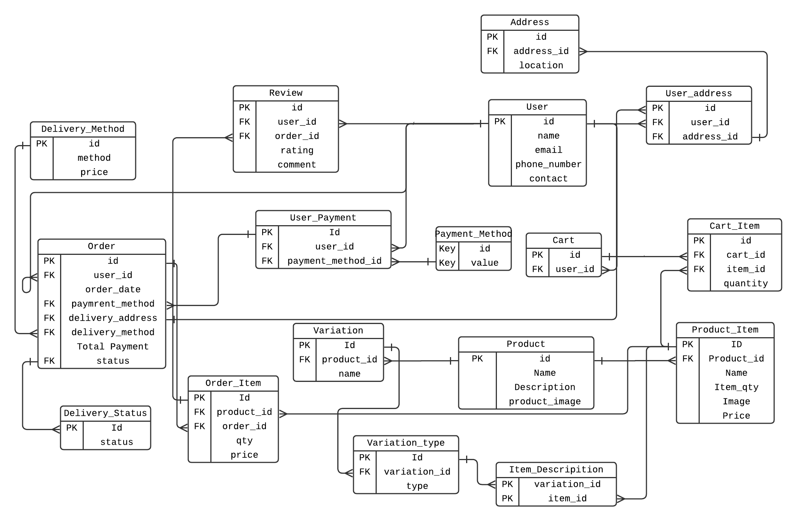

# 🛍️ Project Title: Trinkets E-commerce Database

## 📄 Description

This project provides a fully normalized and relational database schema for an e-commerce platform called **Trinkets**. It covers essential functionalities such as:

- User management and addresses
- Cart and order processing
- Product listings with variations
- Payment and delivery tracking
- Reviews and ratings

---

## 🚀 Setup Instructions

### 🧱 Requirements
- MySQL 5.7+ or compatible server
- MySQL Workbench / CLI / any SQL client

### 📦 Steps to Run

1. **Clone or download** the project.
2. Open your MySQL client.
3. Create a new database:
    ```sql
    CREATE DATABASE trinkets_db;
    USE trinkets_db;
    ```
4. **Import the schema**:
    - Option 1: Manually run the provided SQL script in your client.
    - Option 2: Use CLI:
      ```bash
      mysql -u your_username -p trinkets_db < trinkets_schema.sql
      ```

---

## 🖼️ ERD Diagram

Below is a visual representation of the schema used in this project.


---

## 🧑‍💻 Contributors

- Your Name - [@yourgithub](https://github.com/chie-rit)

---
